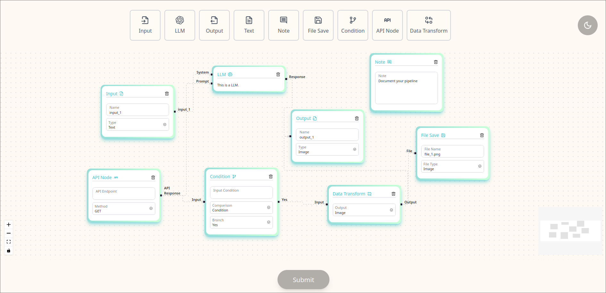

# DAG Detector Frontend

I will guide you through different aspects of the project! I had lots of fun building this one because it was a perfect mixture of **Data Structures and Alogirhtms** with **Web Development**

## Dependencies
- Tailwind CSS - Provides awesome class based styling!
- React-toastify - Toast provider to gracefully display output to the user on clicking submit
- React-textarea-autosize - Component to help manage input dynamically by gorwing and shrinking number of rows. Check [Textarea input builder](https://github.com/Parth0921/vectorshift-OA-frontend/blob/main/src/components/node-builder/nodeInputTextArea.js)

## Run Locally
1. clone the repository
2. `npm install`
3. ` npm run start`

---

## Project Structure
All the source code resides inside src folder. Brief explanation of each folder! I have tried my best to implement a maintainable structure that allows easy extensibility

**1. Components**
This consists of 3 main folders
1. node-builder - It contains all the **reusable components** needed to build any Node
2. nodes - **Nodes** buit using reusable components from node-builder and contains their own logic for user interactions.
3. ui - Consists of components that are on the homepage.

**2. Store**
1. NodeStore - Zustand store for handling logic for nodes on the canvas. I added an extra functionality for the nodes to be deleted and also for an edge to be deleted if we have source handle.

2. ThemeStore - Zustand store which manages theme for the user. It stores the theme in local storage to remember user's preference. If no local theme inside local storage it uses user's system theme as default!

**3. Utils**
Utility functions that are used in multiple files

1. Constants
    1. NodeList - A central place to manage nodes. The nodes array is used for the ui to render the toolbar, then also for reactflow component to let it know what type of nodes are present in the application. To add/delete a node simply add a new entry to the list and it will get updated everywhere!

2. Helper
    1. nodeHelper - A general helper function for all nodes
    2. NodeMapperUI - Builds node and their type object required for Reactflow based on the nodes list constant.

3. Hooks
    1. useFocus - Abstracted implementation to know which input/textarea is active and apply styles for user visibility. Pass the reference of input/textarea as the parameter and it manages event handlers under the hood. Also has a cleanup function to remove event handlers when the component gets unmounted from the DOM.

---

## Approach

My approach to solving this was thinking of nodes which have their own logic which they can pass to a component and it handles the rest. The logic is unique to the node but resuable component which are shared by every node. I thought of node-builder as building blocks for the node hence the name node-builder.

**Steps to add a new Node -- Reusable Component**
1. Create builder for the node if it doesn't exists inside node-builder.
2. Create a Node along with it's own logic and state to use the node-builder blocks to achieve desired configuration.
3. Add the newly created node to NodesList constant inside utils/constants/

Woohoo in just 3 steps a new node can be made!

All the nodes and their brief

1. Note Node - This is not a part of pipeline but serves a purpose for documentation.
2. File Save Node  - Provides options to the user to save intermediate/output locally on their machine in image or text format.
3. Condition Node - Used when the user might want to branch out the logic and implement if --> then into their pipeline. User can pick if they had like to branch out or do nothing based on the condition.
4. API Node - Helps the user when they might want to make external api calls and use the response data in their pipeline. Node provides option to also make POST request upon which input textarea for body appears.
5. Data Transformation Node - Helps the user perform transformations on data. User can pick from image, pdf, csv, txt, and JSON.
6. Input Node - Starting point of the pipeline. User can input any type of data.
7. Output Node - Endpoint where user can either get text/image output.
8. Text Node - User can input text and also use dynamic handlers to pass variables from one node to another.
9. LLM Node - User can choose any LLM model for processing their files.

### Styling
I have picked a theme which resonates with a futuristic vibe for building Pipelines that I feel suits well with VectorShift. The application is available in 2 themes: *Light* and *Dark* this allows the user to work with their preferred theme. I have extended tailwinds colors with accent, primary, and text_secondary.

The nodes are styled with a gradient border which goes well with the coral background. The theme remains consistent throughout which makes the application blend together as cohesive product! Subtle animations are implemented on buttons for easy user access. Overall I hope the team reviewing at VectorShift likes the theme I came up with.

Light Theme

Dark Theme

### Backend Integration - [DAG Detector Backend](https://github.com/Parth0921/dagdetector-backend)

I am making a POST request which contains the payload of nodes and edges after filtering unnecessary information. The backend only needs to know these are the nodes and these are the edges between them to compute if the graph formed is DAG or not. 

Edge cases are covered on the frontend which prevent the user from making API calls by clicking submit button when they have no nodes or no edges between nodes. I am displaying the error/success message using React-toastify in a user-friendly manner. 

The response from the output is shown which tells the user 
1. Number of nodes
2. Number of edges
3. If the graph is DAG or not

---
# Thank you!
